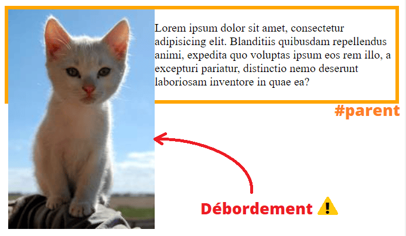
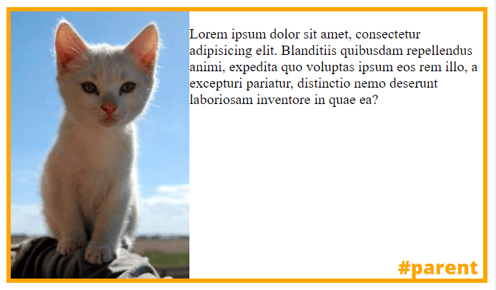
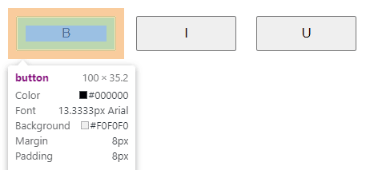
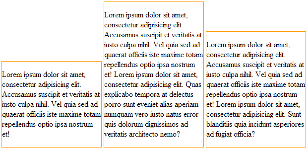
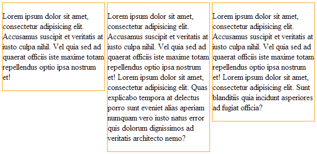
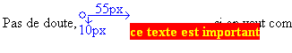
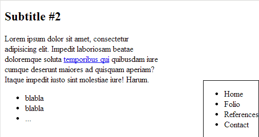
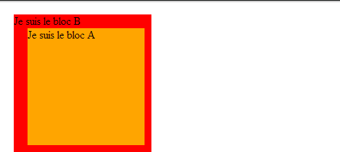
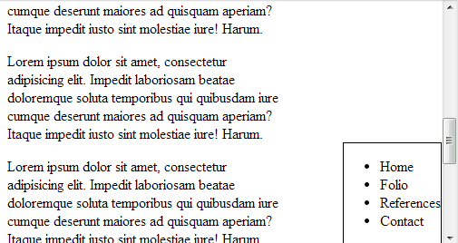

# Positionnement en CSS

Depuis le début de CSS, le positionnement des éléments sur une page web est un sujet récurrent.

Il y a eu plusieurs méthodes pour positionner des éléments sur une page web au fil de l'évolution du standard et des navigateurs Web et mobile.

Aujourd'hui pour créer des _layouts_, on utilise des modules de positionnement modernes comme **Flexbox Module** et **Grid Layout Module**, cependant il peut-être intéressant de voir les autres méthodes de positionnement pour pouvoir les utiliser au bon moment. En effet, même si ces méthodes ne sont plus recommandées pour créer des _layouts_, on peut toujours s'en servir pour de petits positionnements de blocs de texte ou d'images.

## Les flottants

Depuis l'avènement de HTML5 et des navigateurs modernes, l'utilisation des propriétés de flottants ont été grandement critiquées.

Il s'agit d'une bonne chose puisqu'avant l'arrivée de HTML5, on utilisait surtout les flottants pour créer des _layouts_ complets de sites Web, ce qui posait énormément de problèmes dans la gestion de flux de la page, qui se traduisait souvent par des débordements.

En effet, il est important de rappeler que les propriétés de flottements **n'ont jamais été conçues pour cela**. La définition d'un flottant indique que :

> Un élément flottant doit être retiré du flux normal et placé sur le côté droit ou gauche de son conteneur direct.

Soit le code suivant :

```html
<div id="parent">
  

  <p>Lorem ipsum dolor sit amet, …</p>
</div>
```
```css
#parent {
  border: thick solid orange;
}

#parent > img {
  float: left;
}
```

Le résultat est le suivant :

<p align="center">
  <a href="https://jsfiddle.net/qopfjmrv/" target="_blank"></a>
</p>

Il est possible d'indiquer à un bloc parent de contenir les flottants en lui attribuant un **contexte de formatage**. L'une des propriété CSS qui confère ce contexte est `overflow`, avec la valeur `auto` ou `hidden` :

```css
#parent {
  border: thick solid orange;
  overflow: auto; /* confère un contexte de formatage au #parent */
}
```

Le conteneur peut désormais contenir correctement les éléments flottants :

<p align="center">
  <a href="https://jsfiddle.net/qopfjmrv/2/" target="_blank"></a>
</p>

Les contextes de formatage disposent aussi d'autres avantages comme le fait de ne pas subir la [fusion des marges verticales](https://www.alsacreations.com/article/lire/629-fusion-des-marges.html).

> **Note**
> Pour en savoir plus sur le contexte de formatage des blocs, vous pouvez lire l'article suivant :
> **[Le contexte de formatage block en CSS](https://www.alsacreations.com/astuce/lire/1543-le-contexte-de-formatage-block-en-css.html)**

On peut donc aujourd'hui toujours utiliser la propriété `float`, à condition de s'en servir uniquement pour placer un élément à droite ou à gauche d'un autre élément. Très généralement, il s'agit de placer une image à côté d'un texte pour l'écriture d'un article de contenu.

## inline-block 

La deuxième méthode qui a été mise en avant durant un temps était d'utiliser la propriété `display` avec la valeur `inline-block` pour positionner des éléments. 

Une nouvelle fois, cette propriété répond à des cas précis et **ne doit pas être utilisée pour créer des _layouts_**.

La valeur `inline-block` de la propriété `display` indique que l'élément s'inscrit dans le contenu environnant comme une boîte en ligne et organise son propre contenu en bloc.

Certaines balises HTML comme ``, `<input>` ou `<button>` ont ce comportement par défaut : on peut en effet leur attribuer des marges et des dimensions, tout en les plaçant à côté d'autres éléments comme du texte.

```html
<div>
  <button type="button">B</button>
  <button type="button">I</button>
  <button type="button">U</button>
</div>
```

```css
button {
  margin: 0.5rem;
  padding: 0.5rem;
  width: 100px;
}
```

<p align="center">
  
</p>

### Alignement vertical

Un aspect intéressant des éléments positionnés en `inline-block` est qu'ils peuvent être alignés verticalement par rapport à leur conteneur.

Par défaut, cet alignement correspond à la valeur `baseline` de la propriété `vertical-align` (ce qui signifie que le texte est aligné par rapport à la ligne de base du texte environnant).

```html
<div class="column">Lorem ipsum dolor sit amet …</div>
<div class="column">Lorem ipsum dolor sit amet …</div>
<div class="column">Lorem ipsum dolor sit amet …</div>
```

```css
.column {
  display: inline-block;
  border: thin solid orange;
  width: 300px;
}
```

<p align="center">
  <br>
  <i>Comportement par défaut</i>
</p>

La modification de la valeur de `vertical-align` permet de modifier l'alignement vertical des éléments :

```css
.column {
  display: inline-block;
  vertical-align: top;
  /* … */
}
```

<p align="center">
  <br>
  <i>Alignement vertical supérieur</i>
</p>

Ce type de positionnement peut s'avérer utile pour positionner des groupes de boutons ou des icônes à côté d'un texte, cependant il est déconseillé de s'en servir pour gérer des colonnes de texte, notamment à cause de la difficulté à gérer les espaces entre les lignes.

Pour plus d'informations sur le sujet, vous pouvez lire l'article suivant : **[Display inline-block, une valeur trop peu utilisée](https://www.alsacreations.com/article/lire/1209-display-inline-block.html)**

## Les positionnements absolus, relatifs, fixes et sticky

Il est possible de positionner des éléments plus précisemment grâce à la propriété `position`.

S'accompagnent à cela 4 autres propriétés : `top` / `right` / `bottom` / `left`. Ces propriétés peuvent prendre des valeurs en pixels, pourcents, em, rem, …

### Positionnement relatif

La valeur `relative` de la propriété `position` permet de déplacer un élément par rapport à sa position normale, sans pour autant le déplacer hors du flux.

```html
<p>Pas de doute, <strong>ce texte est important</strong>
    si on veut comprendre correctement le positionnement.</p>
```

```css
strong {
  position: relative;
  left: 55px;
  top: 10px;

  background-color: red;
  color: yellow;
}
```

<p align="center">
  <br>
  <i>On constate que le flux du texte n'a pas été impacté.</i>
</p>

On utilise généralement ce positionnement pour de petits ajustements, comme par exemple pour déplacer un élément de quelques pixels pour le placer correctement par rapport à un autre élément.

### Positionnement absolu

La valeur `absolute` de la propriété `position` permet de déplacer un élément **par rapport à son premier parent positionné**. Si aucun parent n'est positionné, l'élément est positionné par rapport au document.

Dans l'exemple qui suit, on positionne le menu `<nav>` en bas à droite de la page, en utilisant le document comme référence.

```html
<nav>
  <ul>
    <li>Home</li>
    <li>Folio</li>
    <li>References</li>
    <li>Contact</li>
  </ul>
</nav>

<h2>Subtitle #2</h2>
<p>Lorem ipsum dolor sit amet, ...</p>
<p>Lorem ipsum dolor sit amet, ...</p>
```

```css
nav {
  position: absolute;
  bottom: 0;
  right: 0;
  
  border: 1px solid black;
}
```

<p align="center">
  <br>
</p>

#### Positionnement absolu avec un parent positionné

Un parent positionné est un élément dont la propriété `position` est différente de `static` (c'est-à-dire `relative`, `absolute` ou `fixed`).

Ainsi, si un bloc A est positionné en absolu à l'intérieur d'un bloc B, lui-même positionné (en absolu, fixe ou relatif), alors **le bloc A se positionnera par rapport au coin supérieur gauche du bloc B**.

Exemple :

```html
<div class="bloc-B">
  Je suis le bloc B

  <div class="bloc-A">
    Je suis le bloc A
  </div>
</div>
```

```css
.bloc-B {
  background-color: red;
  position: absolute;
  top: 20px;
  left: 20px;
  width: 200px;
  height: 200px;
}

.bloc-A {
  background-color: orange;
  position: absolute;
  top: 20px;
  left: 20px;
  width: 170px;
  height: 170px;
}
```

<p align="center">
  <br>
</p>

### Positionnement fixe

La valeur `fixed` de la propriété `position` permet de déplacer un élément par rapport à la fenêtre du navigateur.

Si on reprend l'exemple précédent avec la valeur `fixed` au lieu de `absolute`, on obtient le résultat suivant :

```css
nav {
  position: fixed; /* au lieu de absolute */
  bottom: 0;
  right: 0;

  border: 1px solid black;
}
```

<p align="center">
  <br>
</p>

### Positionnement sticky

La valeur `sticky` de la propriété `position` permet de déplacer un élément par rapport à la fenêtre du navigateur, mais seulement après un certain défilement.

Elle est très pratique pour créer des menus qui restent visibles en haut de la page, même lorsque l'on défile :

```html
<header>
  <h1>Big Header</h1>
</header>

<nav>
  <a href="#">Menu 1</a>
  <a href="#">Menu 2</a>
  <a href="#">Menu 3</a>
  <a href="#">Menu 4</a>
</nav>

<main>
  <p>Lorem ipsum dolor sit amet, …</p>
  …
</main>
```

```css
nav {
  position: sticky;
  top: 0;
}
```

<p align="center">
  <a href="https://jsfiddle.net/zr3jyLo1/" target="_blank"></a>
</p>
