# Positionnement CSS moderne

Aujourd'hui il existe des méthodes en CSS pour permettre de positionner des éléments de manière plus souple et plus simple que les méthodes traditionnelles vues précédemment.

Les positionnements **Flexbox** et **Grid Layout** sont devenus des standards de facto pour le positionnement des éléments sur une page web.

---

# Flexbox Module

Le module de positionnement Flexbox repose sur le principe de _flexibilité_ des éléments. Il permet de distribuer le contenu en **lignes** et en **colonnes** de manière très souple, gère les axes horizontaux/verticaux, les espacement/alignements et l'ordre d'affichage des éléments.

Afin de bien saisir le fonctionnement de ce module, on considère qu'il existe deux type d'éléments :

- le **conteneur parent** qui contient les éléments à positionner 
- les **éléments enfants** qui sont positionnés dans le conteneur parent

Le conteneur parent se voit attribué un comportement de **conteneur flex** grâce à la propriété suivante :

```css
#parent {
  display: flex;
}
```
```html
<div id="parent">
  <div class="enfant">Pomme</div>
  <div class="enfant">Poire</div>
  <div class="enfant">Banane</div>
  <div class="enfant">Fraise</div>
  <div class="enfant">Mangue</div>
</div>
```

À partir de ce moment, les _éléments enfants_ du conteneur sont positionnés en ligne, et peuvent être alignés verticalement et horizontalement sur deux axes :

- axe **principal** (par défaut : horizontal)
- axe **secondaire** (par défaut : vertical)

<p align="center">
  <a href="https://jsfiddle.net/fjov7crt/" target="_blank">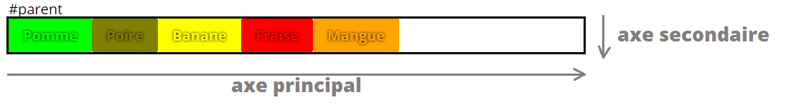</a>
</p>

Il est possible d'intervertir les axes principaux et secondaires en modifiant la valeur de la propriété `flex-direction` :

```css
#parent {
  display: flex;
  flex-direction: column; /* la valeur par défaut est "row" */
}
```

<p align="center">
  <a href="https://jsfiddle.net/fjov7crt/1/" target="_blank">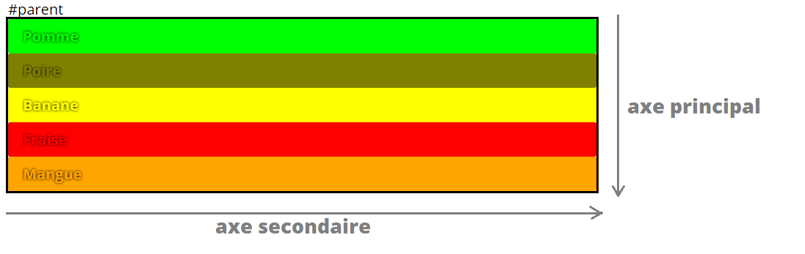</a>
</p>

On peut aussi choisir la direction de l'axe principal en modifiant la valeur de la propriété `flex-direction` :

```css
#parent {
  display: flex;
  flex-direction: row-reverse;
}
```

<p align="center">
  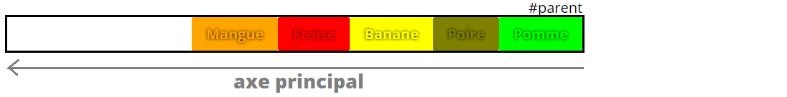
</p>

On peut faire la même chose avec l'axe secondaire :

```css
#parent {
  display: flex;
  flex-direction: column-reverse;
}
```

<p align="center">
  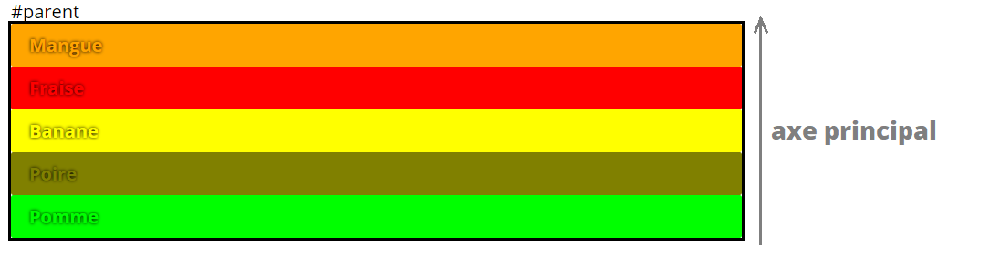
</p>

## Justifier les éléments enfants sur l'axe principal

La propriété `justify-content` permet de justifier les éléments enfants sur l'axe principal.

Elle prend comme valeurs :

- `flex-start` : aligne les éléments enfants sur le bord de départ de l'axe principal
- `flex-end` : aligne les éléments enfants sur le bord d'arrivée de l'axe principal
- `center` : aligne les éléments enfants au centre de l'axe principal
- `space-between` : répartit les éléments enfants sur l'axe principal avec un espace égal entre chaque élément
- `space-around` : répartit les éléments enfants sur l'axe principal avec un espace égal entre chaque élément et autour de chaque élément
- `space-evenly` : répartit les éléments enfants sur l'axe principal avec un espace égal entre chaque élément et autour de chaque élément

Dans un conteneur parent où l'axe principal serait défini à l'horizontale (`flex-direction: row`), voici le rendu de ces différentes valeurs :

<p align="center">
  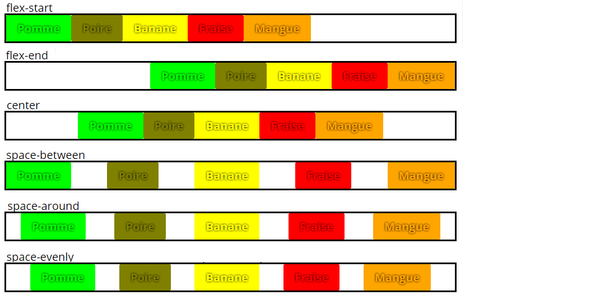
</p>

## Aligner les éléments enfants sur l'axe secondaire

La propriété `align-items` permet d'aligner les éléments enfants sur l'axe secondaire.

Elle prend comme valeurs :

- `flex-start` : aligne les éléments enfants sur le bord de départ de l'axe secondaire
- `flex-end` : aligne les éléments enfants sur le bord d'arrivée de l'axe secondaire
- `center` : aligne les éléments enfants au centre de l'axe secondaire
- `baseline` : aligne les éléments enfants sur la ligne de base de l'axe secondaire
- `stretch` : étire les éléments enfants sur l'axe secondaire

Dans un conteneur parent où l'axe secondaire serait défini à la verticale (`flex-direction: row`), voici le rendu de ces différentes valeurs :

<p align="center">
  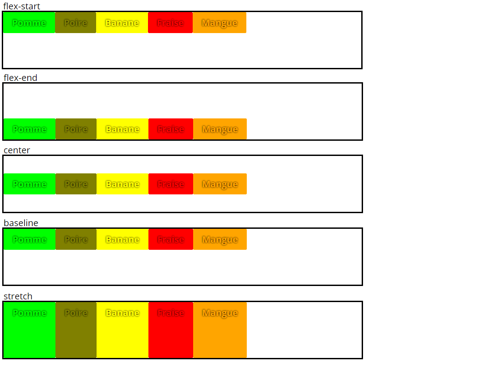
</p>

## Définir la taille des éléments enfants

La propriété `flex` permet de définir la taille d'un élément enfant par rapport aux autres éléments enfants.

Elle est le raccourci de trois propriétés :

- `flex-grow` : permet de définir le rapport de taille entre les éléments enfants
- `flex-shrink` : permet de définir le rapport de réduction de taille entre les éléments enfants
- `flex-basis` : permet de définir la taille de base de l'élément enfant

La valeur par défaut de `flex` pour ces trois propriétés est `0 1 auto` :

```css
.enfant {
  flex: 0 1 auto;

  /* est équivalent à : */
  flex-grow: 0;
  flex-shrink: 1;
  flex-basis: auto;
}
```

<p align="center">
  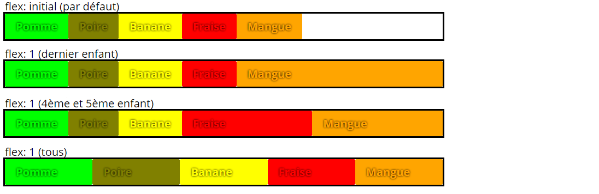
</p>

## Jouer avec l'ordre d'affichage des éléments enfants

La propriété `order` permet de définir l'ordre d'affichage des éléments enfants, et s'applique sur tous les éléments enfants du conteneur parent.

```html
<div class="parent">
  <div class="pomme">Pomme</div>
  <div class="poire">Poire</div>
  <div class="banane">Banane</div>
  <div class="fraise">Fraise</div>
  <div class="mangue">Mangue</div>
</div>
```

```css
.banane {
  order: 2;
}
```

<p align="center">
  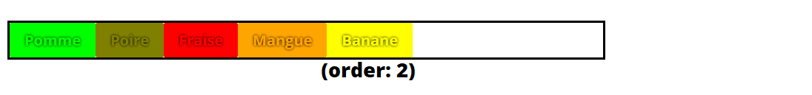
</p>

Par défaut, chaque élément enfant a une valeur de `order` de `0`.

Les éléments `pomme`, `poire`, `fraise` et `mangue` ont donc une valeur de `order` de `0` et sont affichés dans l'ordre dans lequel ils sont définis dans le code HTML.

L'élément `banane` a une valeur de `order` de `2` et est donc affiché en dernière position après ceux qui ont une valeur de `order` de `0`.

> **Note** : Cela peut être pratique pour afficher des éléments enfants dans un ordre différent sur mobile et sur desktop, sans avoir à tenir compte de l'ordre dans lequel ils sont définis dans le code HTML.

---

Pour en savoir davantage sur le module Flexbox, vous pouvez lire les ressources suivantes :

- [MDN : Flexbox](https://developer.mozilla.org/fr/docs/Learn/CSS/CSS_layout/Flexbox)
- [Alsacréations : CSS3 Flexbox Layout module](https://www.alsacreations.com/tuto/lire/1493-css3-flexbox-layout-module.html)

### Jeu - Flexbox Froggy

🐸 http://flexboxfroggy.com/#fr

---

# Grid Layout Module

Le module Grid Layout permet de créer des **grilles de disposition de contenu**. Il propose de diviser l'espace en zones sous forme de lignes et colonnes, comme pour un tableau mais avec plus de contrôle.

Tout comme Flexbox, Grid Layout repose sur la notion **d'élément parent contenant des éléments enfants**.

Les éléments enfants sont appelés **grid items**.

## Créer une grille

Pour créer une grille, il faut définir un élément parent en tant que **grid container**.

```html
<div class="parent">
  <nav>nav</nav>
  <section>section</section>
  <article>article</article>
  <aside>aside</aside>
</div>
```

```css
.parent {
  display: grid;
}
```

On peut ensuite définir le nombre de lignes et de colonnes de la grille avec les propriétés `grid-template-rows` et `grid-template-columns`.

```css
.parent {
  display: grid;

  grid-template-columns: 50% 50%;
  grid-template-rows: 50% 50%;
}
```

<p align="center">
  <a href="https://jsfiddle.net/Lpq1dtmh/" target="_blank">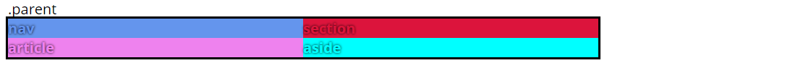</a>
</p>

L'avantage est que les grid items vont automatiquement s'ajuster à la grille du parent si ce dernier dispose de l'espace nécessaire :

```css
.parent {
  display: grid;

  grid-template-columns: 50% 50%;
  grid-template-rows: 50% 50%;

  min-height: 200px; /* dimensionne le parent */
}
```

<p align="center">
  <a href="https://jsfiddle.net/Lpq1dtmh/1/" target="_blank">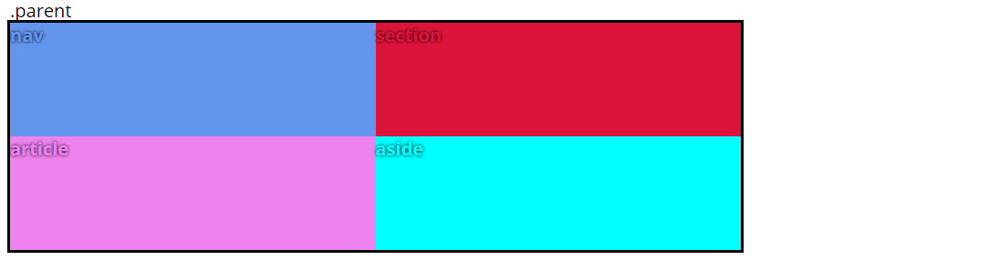</a>
</p>

Ce module est extrêmement riche en fonctionnalités et propose de nombreuses propriétés pour définir la disposition des éléments enfants dans la grille, mais aussi d'une nouvelle unité de mesure : `fr` pour **fragment**, qui désigne un fragment d'espace de la grille :

```css
.parent {
  display: grid;

  grid-template-columns: 2fr 1fr;
  grid-template-rows: 1fr 3fr;

  min-height: 200px;
}
```

<p align="center">
  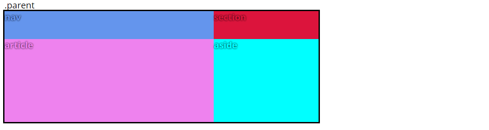
</p>

Ici, la première colonne occupe 2 fragments d'espace, la seconde colonne occupe 1 fragment d'espace.

La première ligne occupe 1 fragment d'espace, la seconde ligne occupe 3 fragments d'espace.

Il est également possible de définir la structure de la grille de façon "visuelle" grâce à la propriété `grid-template` :

```css
.parent {
  display: grid;

  grid-template-columns: 3fr 3fr 1fr;

  grid-template-areas:
    "a b e"
    "a b e"
    "c d e"
    "c d e";
}

.a { grid-area: a; }
.b { grid-area: b; }
.c { grid-area: c; }
.d { grid-area: d; }
.e { grid-area: e; }
```

```html
<div class="parent">
  <div class="a">Zone A</div>
  <div class="b">Zone B</div>
  <div class="c">Zone C</div>
  <div class="d">Zone D</div>
  <div class="e">Zone E</div>
</div>
```

<p align="center">
  <a href="https://jsfiddle.net/Lpq1dtmh/2/" target="_blank">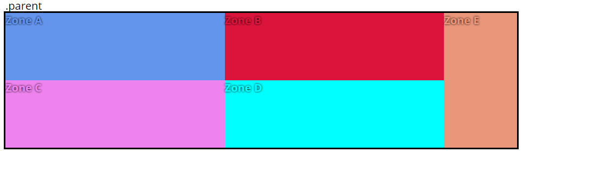</a>
</p>

Pour centrer un élément seul au sein de la grille, on peut utiliser les propriétés `justify-self` et `align-self` sur cet élément :

```css
.b {
  align-self: flex-end;
  justify-self: center;

  /* Version raccourcie avec `place-self` : */
  place-self: flex-end center;
}
```

<p align="center">
  <a href="https://jsfiddle.net/Lpq1dtmh/4/" target="_blank">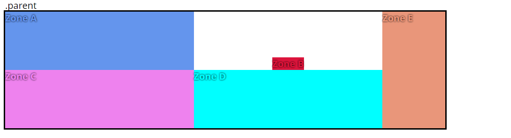</a>
</p>

Les possibilités de placement des **grid items** sont nombreuses.

Il est conseillé d'aller lires les articles suivants :

**Articles introductifs de qualité :**

- [MDN : Grilles CSS](https://developer.mozilla.org/fr/docs/Web/CSS/CSS_Grid_Layout)
- [Alsacréations : CSS3 Grid Layout](https://www.alsacreations.com/article/lire/1388-css3-grid-layout.html)

**Article traitant de l'alignement :**

- [MDN : L'alignement des boîtes avec les grilles CSS](https://developer.mozilla.org/fr/docs/Web/CSS/CSS_Grid_Layout/Box_Alignment_in_CSS_Grid_Layout)

### Jeu - CSS Grid Garden

🥕 http://cssgridgarden.com/#fr
